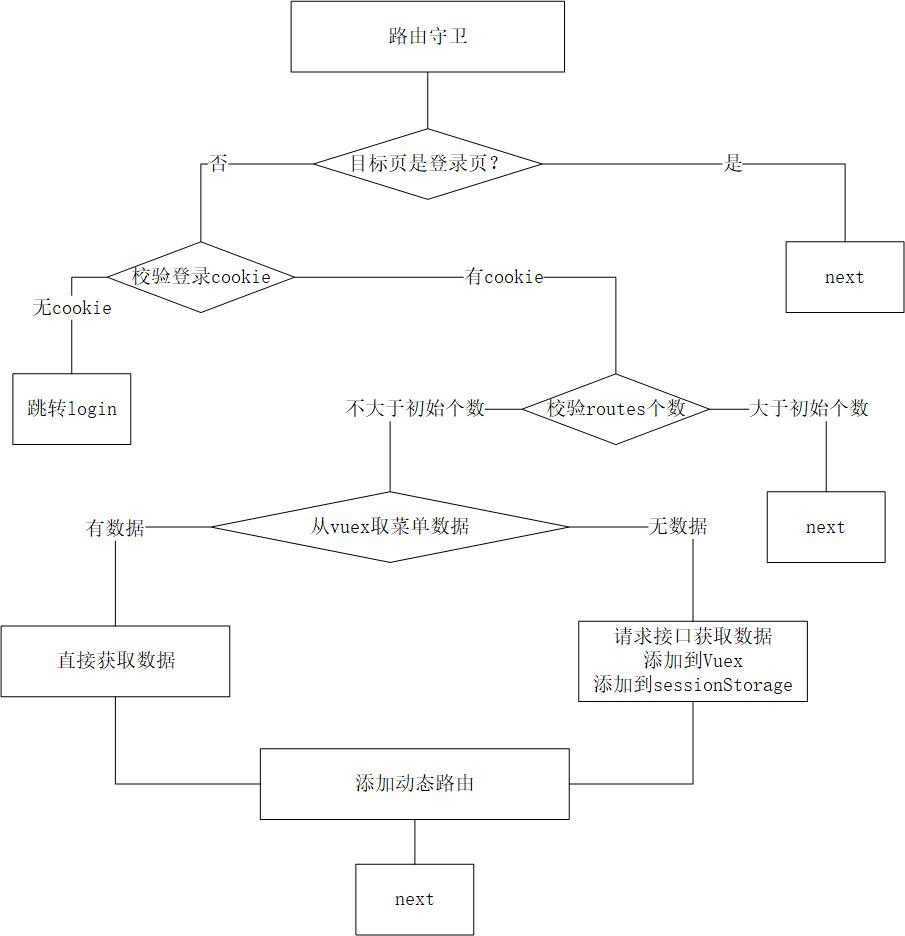

体验地址

github page：https://github.zhongpeng.wang/vue-iview

gitee page：http://wangzp93.gitee.io/vue-iview

### 初始化/还原 动态路由


### 登录


### 退出登录


### 动态路由
1. 解析menuData时，最终输出只有两级，第一级为nav，第二级为子菜单扁平化
2. 在路由守卫beforeEach中，用router.addRoute挂载在根路由"/"下
3. 动态路由后next时，需使用replace避免白屏
```javascript
next({...to, replace: true})
```

### 刷新后vuex消失
1. 需要持久态的vuex，初始化时直接从sessionStorage取
2. 每次mutation赋值时，同时向sessionStorage存一份即可
```javascript
state: {
  status: sessionStorage.getItem('status') || 0
}
```

### 刷新后动态路由消失
1. 路由守卫中，通过校验router.getRoutes()个数，判断动态路由是否存在
2. 如果动态路由消失，从vuex取数据重新添加

### 退出登录注意项
1. 除清除cookie、sessionStorage外，还要重置Vuex与动态路由，避免用户权限出错，
2. Vuex与动态路由的清除，可通过location.reload实现

### 路由变化菜单高亮联动问题
用vuex

### 编辑或详情页面，菜单高亮问题

### 菜单key问题
避免key重复，使用路径拼接形式，如：nav/first/second/leaf，开头不带/

### 全局主题
除iview官方文档外，还可在vue.config.js中配置css的lessOptions，
本次使用后者，因为可以定义全局less变量

### 部署问题
vue.config.js，配置publicPath为项目名，以/开头

