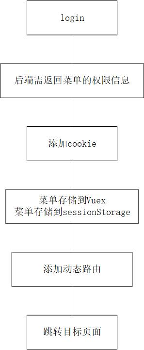

### 备份vuex

### 初始化/还原 vuex与动态路由

### 登录

### 退出登录

### 动态路由
1. 解析menuData时，最终输出只有两级，第一级为nav，第二级为子菜单扁平化，并将原始menuData保存至vuex
2. 在路由守卫beforeEach中，用router.addRoute挂载在根路由"/"下
3. 动态路由后next时，需使用replace: true避免白屏

### 刷新后vuex与动态路由消失
+ 页面生命周期beforeunload中，把vuex数据暂存至sessionStorage
+ 路由守卫中，每次校验Vuex是否存在

### 退出登录注意项
除清除cookie外，还要重置Vuex与动态路由，避免用户权限出错

### 路由变化菜单高亮联动问题
用vuex

### 编辑或详情页面，菜单高亮问题

### 全局主题
除iview官方文档外，还可在vue.config.js中配置css的lessOptions，
本次使用后者，因为可以定义全局less变量

